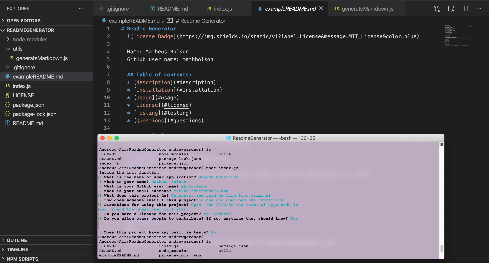

# Read me generator
  
  
  Name: Matheus Bolson

  GitHub user name: mathbolson

  [Youtube link](https://youtu.be/qSuruLEXTak)
  
    
  ## Table of contents:  
  * [description](#description)
  * [Installation](#Installation)
  * [Usage](#usage)
  * [License](#license)
  * [Testing](#testing)
  * [Questions](#questions)
  
  ## Description:
  Formats and generates a read me file from the terminal.

  ## Installation:
  Clone and download the repository.

  ## Usage:
  Open the file in the terminal type npm install, and then npm start and the questioner will begin.  

  ## license:
  MIT_License
  
  ## Contributing:
  Yes, clone the repository make your edits and then create a push request to be reviewed.  

  ## Testing:
  No.

  ## Questions:
  Contact Matheus Bolson with any questions at mathbolson@hotmail.com
